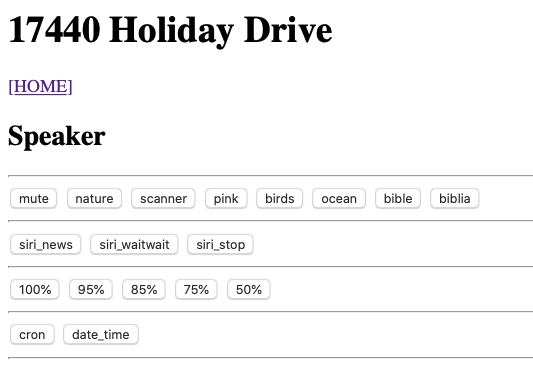

# Speaker pi
## Home page


Web pages with stations:
- https://radio-locator.com
- https://www.internet-radio.com

# Pages that have internet streaming
  - https://www.radioforge.com/faqs/find-valid-radio-stream-url-from-icecast-or-shoutcast-pls-m3u-xspf/

# Volume control
- amixer set PCM -- 100%
  - https://blog.paddlefish.net/?p=895

# Text to speach
- what worked for me was:gTTS
  - https://pythonprogramminglanguage.com/text-to-speech/

# Text only
- Lynx - text only browser
  - https://en.wikipedia.org/wiki/Lynx_(web_browser)/
  - https://opensource.com/article/16/12/web-browsers-linux-command-line
- Text only news:
  - https://greycoder.com/a-list-of-text-only-new-sites/

# Mount USB
- https://www.raspberrypi-spy.co.uk/2014/05/how-to-mount-a-usb-flash-disk-on-the-raspberry-pi/

# Flask config file
- https://pythonise.com/series/learning-flask/flask-configuration-files
- https://flask.palletsprojects.com/en/1.0.x/config/

# config file (config.py)
This is an example of what the file looks like, this may not be the current content.

```
    STATIONS = {
              "nature1" : "http://192.240.102.198:14244/listen.pls",
              "nature2" : "http://5.39.71.159:8157/listen.pls",
              "nature3" : "http://162.244.80.118:9196/listen.pls",
              "chill1" : "http://192.99.17.12:4516/listen.pls",
              "chill2" : "http://192.99.17.12:4950/listen.pls",
              "trance1" : "http://uk4.internet-radio.com:8049/listen.pls",
              "trance2" : "http://hirschmilch.de:7000/listen.pls",
              "bass1" : "http://uk1.internet-radio.com:8118/listen.pls",
              "experimental1" : "http://dallas.myautodj.com:8099/listen.pls",
              "experimental2" : "http://akademieradio.de:80/play.m3u",
              "experimental3" : "http://198.27.66.225:8570/listen.pls",
              "experimental4" : "http://198.15.77.50:9368/listen.pls",
              "experimental5" : "http://50.7.68.251:6982/listen.pls",
              "dogs1" : "http://99.198.118.250:8241/listen.pls",
              "dogs2" : "http://yp.shoutcast.com/sbin/tunein-station.pls?id=1794904",
              "dogs3" : "http://yp.shoutcast.com/sbin/tunein-station.pls?id=1632399",
              "talk1" : "http://176.31.98.109:4962/listen.pls",
              "talk2" : "http://69.46.24.226:7006/listen.pls",
              "talk3" : "http://74.50.122.103:7372/listen.pls",
              "talk4" : "http://95.211.3.65:9185/listen.pls"
              }
```

# The crontab file
This is an example of what the crontab file (in the speaker.local pi) looks like:
```
@reboot /home/pi/speaker-pi/source/start.sh

0 10 * * * curl -X POST http://localhost:5000/play_station/chill1/
0 18 * * * curl -X POST http://localhost:5000/mute/
```

# Links
- https://github.com/bobrathbone/piradio/blob/master/station.urls
